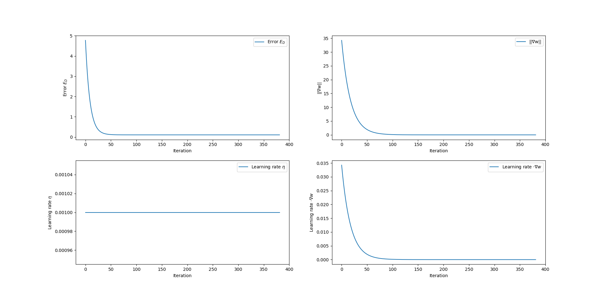

# LinearRegression

Implementation of Linear Regression and BFGS in Julia I did for a term paper for a machine learning course in the winter semester 2019/2020.

## Paper

https://github.com/SV-97/LinearRegression/blob/master/Tex/paper.pdf

## Plots

